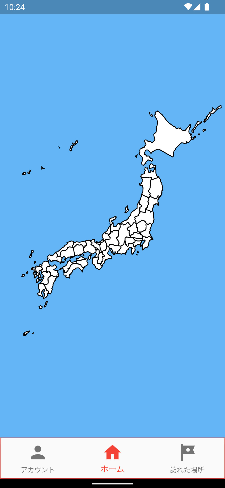
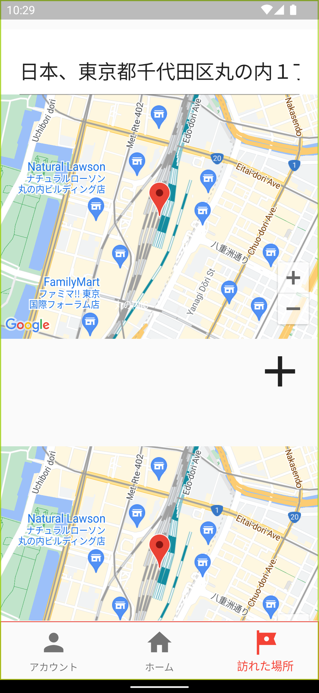
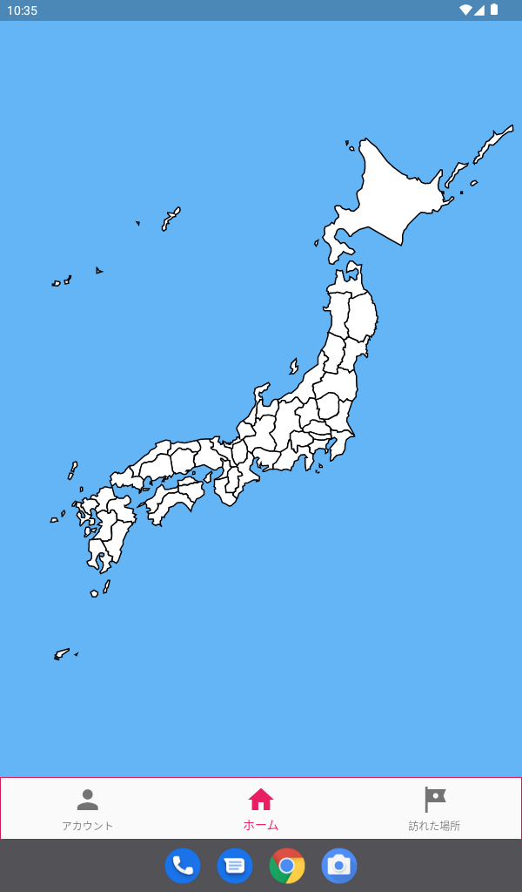
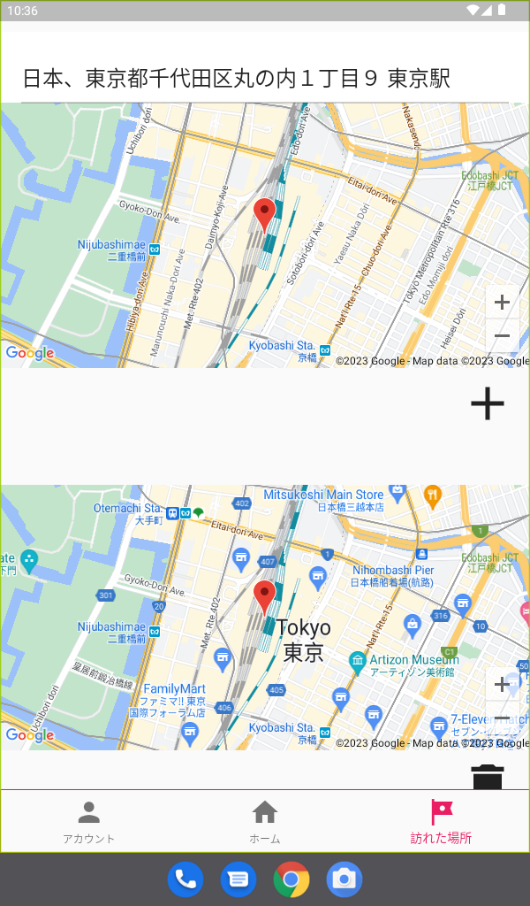
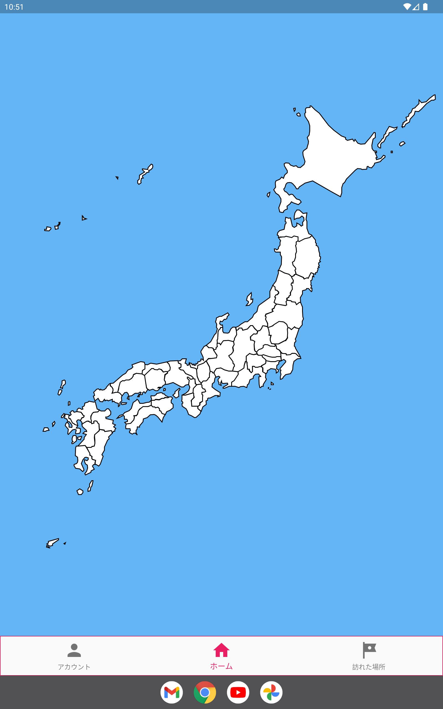
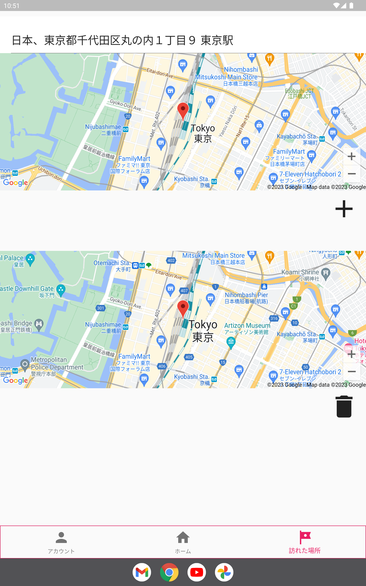
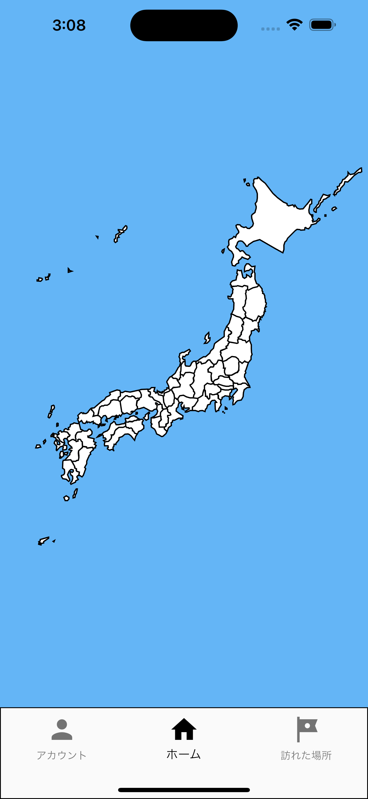
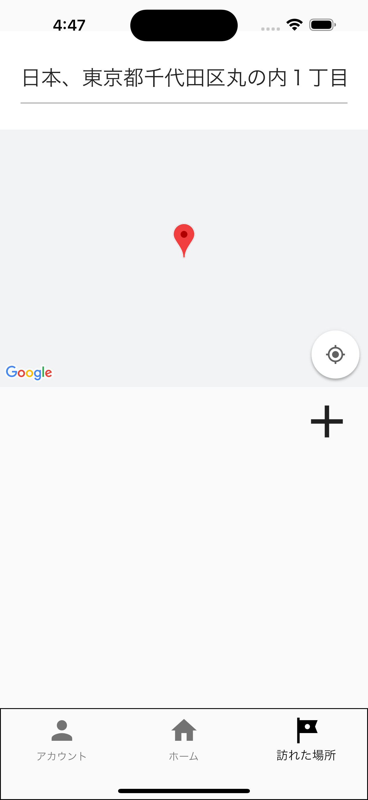
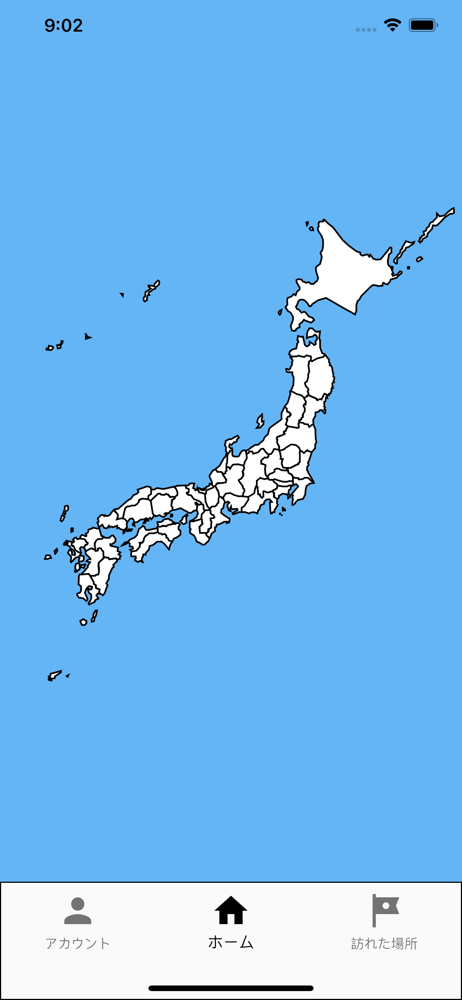
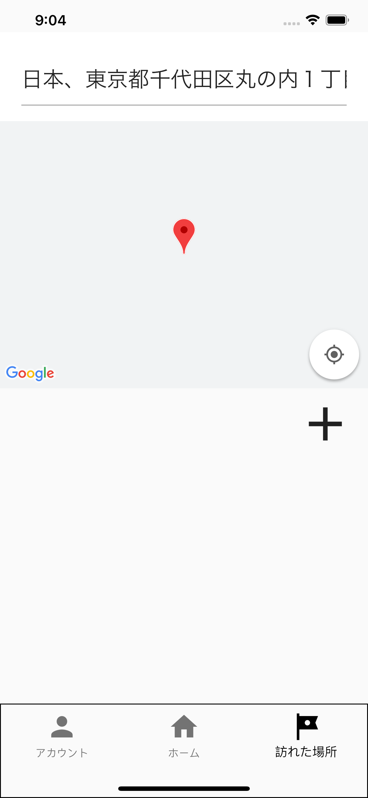

# リリース準備

## アプリ名

Tabichizu

## アプリ説明文

このアプリでは、地図で検索した場所を登録できます。
登録した場所は、その場所の都道府県を読み取ってホーム画面の日本地図に色が塗られます。

アカウント画面では、ユーザーの写真、ユーザー名、テーマカラーを設定することができます。
テーマカラーは、そのまま日本地図の色塗りに対応します。

## アイコン

## スクリーンショット

### GooglePlay

#### 携帯電話

#### 7 インチタブレット

#### 10 インチタブレット

### AppStore

#### 6.7 インチ iPhone

#### 6.5 インチ iPhone

#### 5.5 インチ iPhone

#### 12.9 インチ iPad Pro（第 6 世代）

#### 12.9 インチ iPad Pro（第 2 世代）
